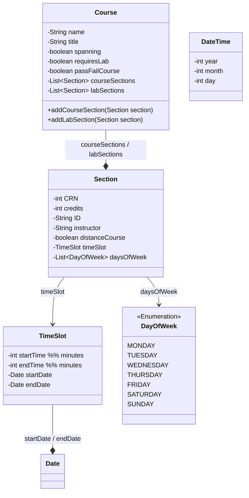

```mermaid
classDiagram
    class Course {
        -String name
        -String title
        -boolean spanning
        -boolean requiresLab
        -boolean passFailCourse
        -List~Section~ courseSections
        -List~Section~ labSections
        +addCourseSection(Section section)
        +addLabSection(Section section)
    }

    class Section {
        -int CRN
        -int credits
        -String ID
        -String instructor
        -boolean distanceCourse
        -TimeSlot timeSlot
        -List~DayOfWeek~ daysOfWeek
    }

    class TimeSlot {
        -int startTime %% minutes
        -int endTime %% minutes
        -Date startDate
        -Date endDate
    }

    class DayOfWeek {
        <<Enumeration>>
        MONDAY
        TUESDAY
        WEDNESDAY
        THURSDAY
        FRIDAY
        SATURDAY
        SUNDAY
    }

    class DateTime {
        -int year
        -int month
        -int day
    }

    %% Class Relationships
    Course --* Section : courseSections / labSections
    Section --> TimeSlot : timeSlot
    Section --> DayOfWeek : daysOfWeek
    TimeSlot --* Date : startDate / endDate
```